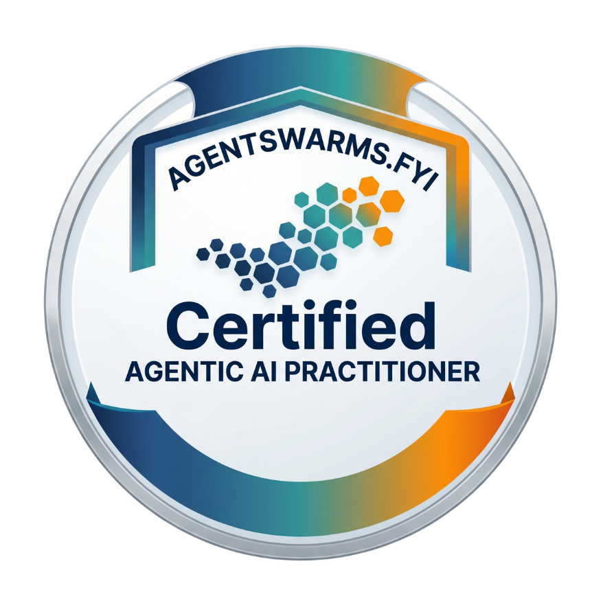

<div align="center">
  

  <h1>AgentSwarms</h1>

  <p><strong>Deploy your own agentic AI platform — with learning guidance built in.</strong><br />
  Build agents, run multi-agent swarms, ground them in your data, and inspect
  every trace — on your own infrastructure, with your own keys.</p>

  <p>
    
    
    
    
    
    
  </p>

  <p>
    <a href="#features">Features</a> ·
    <a href="#getting-started">Getting started</a> ·
    <a href="#installation-guide">Installation guide</a> ·
    <a href="#production-deployment">Deployment</a> ·
    <a href="#this-repo-vs-agentswarmsfyi">Open source vs. hosted</a> ·
    <a href="./CONTRIBUTING.md">Contributing</a>
  </p>
</div>

---

**AgentSwarms open source** is a complete, self-hostable agentic AI platform:
an agent playground, a visual multi-agent swarm canvas, knowledge bases with
RAG, tool use, MCP connections, budgets, and full execution traces — plus the
guided learning content to make sense of it all. It is designed for **easy
deployment**: one Supabase project as the backend, one Docker command to run,
and **bring-your-own-everything** — your data lives in your own Supabase
project, and models run against your own provider keys (OpenRouter, OpenAI,
Anthropic, Gemini, Bedrock, Azure, OCI, Qwen, Grok, Groq, Ollama, vLLM…).
Optionally set one instance-wide OpenRouter key so every user on your
instance can start with zero setup.

## This repo vs. agentswarms.fyi

Same UI, two different missions:

|              | **This repository (MIT)**                                                                                                                                                  | **[agentswarms.fyi](https://agentswarms.fyi) (hosted)**                                                                                                                 |
| ------------ | -------------------------------------------------------------------------------------------------------------------------------------------------------------------------- | ----------------------------------------------------------------------------------------------------------------------------------------------------------------------- |
| **Focus**    | **Easy deployment of the full agentic AI platform** on your own infrastructure — agents, swarms, RAG, traces, budgets — with the learning curriculum included as guidance. | **Learning first**: a hands-on classroom for agentic AI — guided curriculum, build-along labs, interactive notebooks, presentations, and certification — fully managed. |
| **Runs on**  | Your Supabase project, your provider keys, your Docker host (or Cloudflare Workers).                                                                                       | Managed infrastructure, including an AI gateway with free-tier models — nothing to configure.                                                                           |
| **Extras**   | Headless control of your own data; no usage caps other than your own budgets.                                                                                              | Hosted-only surfaces: field-engineering blog, community galleries, voice agents, website embeds, and free standalone tools.                                             |
| **Best for** | Teams and tinkerers who want to **run** an agentic AI platform they own.                                                                                                   | Learners who want to **study and practice** agentic AI without setting anything up.                                                                                     |

The "AgentSwarms" name and the hosted service remain with the project author.

## Features

|                              |                                                                                                                                                                                                         |
| ---------------------------- | ------------------------------------------------------------------------------------------------------------------------------------------------------------------------------------------------------- |
| 🤖 **Agent Playground**      | Build an agent, wire up tools, and chat with it in-browser, with full request/response traces.                                                                                                          |
| 🐝 **Swarm canvas**          | Design multi-agent workflows visually (built on [XYFlow](https://xyflow.com)) and execute them end-to-end.                                                                                              |
| 📚 **Knowledge Base / RAG**  | Upload documents, chunk and embed them (pgvector), and ground agents in your own data.                                                                                                                  |
| 🏢 **Data warehouses**       | Connect Amazon Redshift, Snowflake, Databricks, Google BigQuery, or Azure Synapse (encrypted credentials, read-only). Query them from the Data & SQL page, from SQL agents, and feed BI charts.         |
| 🔑 **Secrets Manager**       | Store credentials once (encrypted, write-only) and reference them anywhere as `{{secret:NAME}}` — warehouse connections, provider keys. Superadmins share secrets with users/groups via IAM.            |
| 📊 **Business Intelligence** | A BI Workspace with drag-and-drop dashboards: build charts from local datasets or connected warehouses, generate visuals with the AI analyst, then publish with a public link or share with IAM groups. |
| 🔍 **Observability**         | Inspect every tool call, token, and cost in a full execution trace.                                                                                                                                     |
| 🔌 **BYOK + MCP + A2A**      | Encrypted per-user provider keys, MCP server connections, swarm export to LangGraph/CrewAI/OpenAI SDK/Strands, and an A2A endpoint.                                                                     |
| 🛂 **IAM**                   | Superadmins, groups, invite/manual user provisioning, per-user/group model allow-lists, read-only sharing of KBs and data tables, invite-only mode.                                                     |
| 🧭 **Guided curriculum**     | Five tracks — Foundations, Patterns & Tools, SQL Agents, Multi-Agent Swarms, Scaling & Enterprise — each chapter pairs a concept with something you actually run.                                       |
| 📓 **Python Lab**            | Your own in-browser Python notebooks (Pyodide) — experiment with code and frameworks, with a built-in helper for calling your connected models.                                                         |
| 🛡️ **Guardrails & evals**    | Prompt-injection tests, PII redaction, LLM-as-judge scoring — hands-on, not hypothetical.                                                                                                               |
| 🎓 **Certification**         | Pass the exam, get a verifiable certificate and badge.                                                                                                                                                  |

<div align="center">
  
  <br />
  <sub>Every learner who passes the certification exam earns a verifiable badge like this one.</sub>
</div>

## Tech stack

| Layer        | Tech                                                                                            |
| ------------ | ----------------------------------------------------------------------------------------------- |
| Framework    | [TanStack Start](https://tanstack.com/start) (React 19), file-based routing via TanStack Router |
| Backend      | [Supabase](https://supabase.com) — Postgres, Auth, Storage, pgvector                            |
| Styling      | [Tailwind CSS](https://tailwindcss.com) + [shadcn/ui](https://ui.shadcn.com)                    |
| Agents       | [LangChain](https://js.langchain.com) / LangGraph                                               |
| Swarm canvas | [XYFlow](https://xyflow.com)                                                                    |
| Deployment   | Docker (Node) — primary · Cloudflare Workers — secondary                                        |

## Access control (IAM)

The account whose email matches `ADMIN_EMAIL` is the instance's **bootstrap
superadmin** — sign in with it and open **Admin → IAM** (`/admin/iam`) to
manage everything else:

- **Users** — invite by email (Supabase sends the invitation) or create
  accounts with a temporary password; ban/unban; delete; promote additional
  superadmins. The bootstrap superadmin can never be demoted, and the last
  superadmin is protected.
- **Groups** — organize users; model rules and resource shares can target a
  whole group at once.
- **Model access** — by default every user may call every model. Add allow
  rules to a user or group to restrict them (patterns: `*`, `openai/*`, or an
  exact model id; the allowed set is the union of all applicable rules).
  Enforced server-side on every LLM call and reflected in the model pickers.
- **Shares** — grant users or groups **read-only** access to any knowledge
  base, SQL data table, secret, or BI dashboard; recipients' agents can
  search/query them but never modify them.
- **Settings** — flip the instance to **invite-only**: public self-signup
  (including OAuth) is rejected at the database level, while invited,
  admin-created, and SSO-provisioned users still get in.
- **SSO** — connect enterprise identity providers (Okta, Auth0, Microsoft
  Entra ID, or any SAML 2.0 IdP) so users sign in with their work account.
  The tab shows the two values to paste into your IdP's SAML app (ACS URL
  and Entity ID), takes the IdP's metadata URL/XML plus the email domains it
  covers, and adds a "Continue with single sign-on" flow to the login page.
  Optionally **require SSO**, hiding email/password and social login
  (`/login?native=1` remains as a superadmin escape hatch).

  > SAML SSO must be enabled on your Supabase project first: hosted Supabase
  > → **Authentication → Sign In / Up → SSO (SAML 2.0)** — a Pro-plan
  > feature; self-hosted GoTrue → set `GOTRUE_SAML_ENABLED=true` with a
  > `GOTRUE_SAML_PRIVATE_KEY`. The SSO tab detects and explains this if it's
  > not enabled yet.

## Business Intelligence

The **BI Workspace** (`/bi`) turns connected data into shareable dashboards
and reports. An editable dashboard is called a **BI project**:

- **Build visuals by hand** — a right-hand builder pane: pick a source (your
  Data & SQL datasets or any connected warehouse), tick one or **more tables
  to join** (a JOIN skeleton is written for you with auto-detected join
  keys), run the read-only SQL, then pick from **18 visual types** in an
  icon picker: column, bar, line, area, **combo (bars + line, dual axis)**,
  **scatter**, pie/donut, **funnel**, **treemap**, **heatmap**,
  **box &amp; whisker**, **waterfall**, KPI card (with target comparison),
  **gauge**, **matrix (pivot) table**, **filled map** and **bubble map**
  (country-level, fully offline — no tile servers), and table. Column, line
  and area charts support **multi-series** (split by a category column —
  grouped or stacked), and every numeric visual takes a **value format**
  (currency / percent). Widgets live on a 12-column drag-and-resize grid,
  with markdown text blocks for report narrative.
- **Filters &amp; cross-filtering** — add dashboard filters (value slicers
  and date ranges) that apply to every widget containing that column, and
  **click any bar or pie slice to cross-filter** the rest of the dashboard.
  Both work on the stored snapshots — in the editor, the shared read-only
  view and the public link — and PDF export captures the filtered view.
- **Generate visuals with AI** — the same GenBI analyst as the Data & SQL
  page (plan → SQL → execute → chart → narrative) lives in the pane's **AI
  analyst** tab; insert any answer as a widget. On `/data-sql`, every
  generated visual also has an **Add to dashboard** button. Scope the
  analyst with **Tables to analyse**, and optionally select **knowledge
  documents** (up to 6, from any knowledge base you can read): the analyst
  then cross-references the query result with the documents' most relevant
  passages and blends both into the insight — naming each document it draws
  on, and saying plainly when it finds **no correlation** between the
  structured data and the selected documents rather than inventing one.
  With no documents selected it analyses structured sources only.
- **AI insights per visual** — every chart's menu has **AI insight**: the
  analyst reads that widget's data and drops a markdown card below it with
  what the data shows, caveats to watch, and suggested next steps.
- **Ontology visual** — an AI-built knowledge map of your whole data
  estate. Pick "Ontology" in the visual picker and choose the sources to
  include — expand any group to select **individual tables** (local &amp;
  prepared datasets, each connected warehouse's schema) or **individual
  knowledge bases**, with tri-state group checkboxes and live selection
  counts — then hit **Build ontology with AI**: relationships are
  first detected deterministically (semantic-layer join hints, `*_id` →
  target-table key matching across sources, data-prep lineage), then one
  AI pass classifies every entity (master data / transactions / events /
  reference / metrics / documents), groups them into business domains,
  labels each relationship with a verb and cardinality, infers additional
  cross-source links and writes an executive summary. The result renders
  as an interactive force-directed map — entity cards with source badges
  and row/column counts inside shaded domain clusters, typed edges
  (solid = join key, dotted = prep lineage, dashed = AI-inferred) with
  key and cardinality labels, hover to spotlight a neighbourhood with a
  detail panel, plus zoom/fit/pan. If the AI call fails the detected
  structure still renders with heuristic labels and a visible note. The
  whole map is stored in the widget, so it publishes, shares and exports
  to PDF like any other visual.
- **Pick the AI model** — the BI agent on Data & SQL and every generative
  feature in the BI Workspace (AI analyst, insights) runs on a text model
  picked from **your connected integrations**: one group per connected
  OpenAI-compatible provider (its configured default model first), with the
  full catalog when OpenRouter is connected — filtered by your IAM model
  rules and enforced server-side. Calls are **BYOK**: they execute against
  the chosen integration's own key, with the operator's shared
  `OPENROUTER_API_KEY` only as a zero-config fallback. When publishing, choose a **reader AI model**:
  signed-in viewers of a shared dashboard get an **Ask AI** panel that
  answers questions from the stored data snapshots using that model — and
  sharing with a group is validated against the group's IAM model rules
  (the anonymous public link stays data-only, no AI).
- **Refresh** re-runs every widget's SQL against its source and stores a
  capped **data snapshot** in the dashboard.
- **Export PDF** — one click renders the dashboard (layout preserved) into a
  downloadable A4 PDF report, entirely client-side.
- **Data preparation** — a visual prep studio (BI Workspace → Data
  preparation): drag tables onto the canvas to build a join pipeline (left /
  inner / right / full outer, join keys auto-detected from matching column
  names, colliding columns auto-aliased), rename columns and set their types
  — Text, Integer, Decimal, Date, Boolean, **Location**, Category, Currency,
  Percentage, Identifier — with un-convertible values nulled and counted.
  The result preview updates live at the bottom. **Run &amp; save**
  materialises the result as a local dataset (joinable again, chartable,
  visible to the AI analyst and SQL agents, semantic types recorded in the
  semantic layer) and the flow itself is saved for re-editing and re-running.
  External warehouse tables can be pulled in as capped snapshots to join
  against local data.
- **Publish & share** — publishing exposes a read-only page at
  `/share/bi/<unguessable-slug>` for anyone with the link; group sharing
  (owner-controlled, or superadmin via Admin → IAM) makes the dashboard
  appear read-only in members' BI Workspace. Viewers always see the stored
  snapshots — your warehouse credentials are never used on their behalf and
  never leave the server.

## Getting started

There is no separate backend to install — **Supabase _is_ the backend**
(Postgres + Auth + Storage), and you run it as a free-tier hosted project
rather than installing anything yourself. The quick version:

```bash
git clone <your-fork-or-repo-url> agentswarms
cd agentswarms
npm install
cp .env.example .env   # fill in your Supabase + provider keys (see guide below)
# apply the database schema once: npx supabase login && npx supabase link && npx supabase db push
npm run dev            # → http://localhost:8080
```

Self-host with Docker (any Node-capable host — VPS, Fly, Railway, Render, K8s):

```bash
cp .env.example .env   # fill in Supabase + keys, apply migrations once
docker compose up --build
# → http://localhost:8080
```

First time? Follow the full guide below — it covers every step, including
the dashboard clicks, and a troubleshooting section for the errors people
actually hit.

## Installation guide

A complete local setup on **macOS**, **Linux**, and **Windows** — installing
dependencies, standing up your own Supabase project (database, auth,
storage), configuring environment variables, and running the app.

### 1. Prerequisites

| Requirement                                   | Version              | Why                                                                                                               |
| --------------------------------------------- | -------------------- | ----------------------------------------------------------------------------------------------------------------- |
| **Node.js**                                   | `20.19+` or `22.12+` | Required by Vite 7. Older Node 18 will fail to start the dev server.                                              |
| **npm** (bundled with Node) or **Bun** `1.1+` | —                    | Either works — both `package-lock.json` and `bun.lock` are committed. Use one consistently.                       |
| **Git**                                       | any recent           | to clone the repo                                                                                                 |
| **A Supabase account**                        | free tier is enough  | [supabase.com](https://supabase.com) — this is your database, auth, and file storage                              |
| **Supabase CLI**                              | `2.x`                | _(recommended, not strictly required)_ — the fastest way to apply the project's ~60 SQL migrations in one command |

Optional, but needed for a fully working app:

| Optional                                                                  | Why                                                                                                                                                       |
| ------------------------------------------------------------------------- | --------------------------------------------------------------------------------------------------------------------------------------------------------- |
| **OpenRouter API key** ([openrouter.ai/keys](https://openrouter.ai/keys)) | Without it, nobody can chat with an agent until they add their own provider key under `/integrations`. With it, the app works zero-config for every user. |
| **OpenAI API key** ([platform.openai.com](https://platform.openai.com))   | Powers Knowledge Base embeddings (RAG / vector search). Without it, KB search silently falls back to keyword search.                                      |

#### macOS

```bash
# Node (via nvm — recommended over the system/Homebrew Node so you can pin versions)
curl -o- https://raw.githubusercontent.com/nvm-sh/nvm/v0.40.1/install.sh | bash
source ~/.zshrc   # or ~/.bashrc / ~/.bash_profile
nvm install 22
nvm use 22

# Git (skip if `git --version` already works — ships with Xcode Command Line Tools)
xcode-select --install

# Supabase CLI
brew install supabase/tap/supabase

# Bun (optional, only if you prefer it over npm)
curl -fsSL https://bun.sh/install | bash
```

#### Linux (Ubuntu/Debian; adapt package manager for other distros)

```bash
# Node (via nvm)
curl -o- https://raw.githubusercontent.com/nvm-sh/nvm/v0.40.1/install.sh | bash
source ~/.bashrc
nvm install 22
nvm use 22

# Git
sudo apt update && sudo apt install -y git

# Supabase CLI — a global `npm install -g supabase` is explicitly unsupported
# by Supabase, so use one of these instead:
#   Option A — Homebrew (works on Linux too, not just macOS):
brew install supabase/tap/supabase
#   Option B — no install needed, invoke on demand via npx:
#     npx supabase login
#     npx supabase link --project-ref <your-project-id>
#     npx supabase db push
#   Option C — grab the current Linux binary from the releases page and put
#   it on your PATH: https://github.com/supabase/cli/releases (look for the
#   linux_amd64 or linux_arm64 asset matching your CPU architecture).

# Bun (optional)
curl -fsSL https://bun.sh/install | bash
```

#### Windows

**Use WSL2 (Windows Subsystem for Linux) — strongly recommended.** The
project's `build`/`build:dev` npm scripts set an env var inline
(`NODE_OPTIONS=--max-old-space-size=6144 vite build ...`), which is POSIX
shell syntax that **plain `cmd.exe` and native PowerShell cannot run
as-is**. `npm run dev` (the command you'll use day-to-day) doesn't have this
problem, but you'll hit it the first time you try `npm run build`. WSL2
sidesteps this entirely by giving you a real Linux shell, and it's also
generally the smoother path for Node tooling on Windows.

```powershell
# In an elevated PowerShell:
wsl --install -d Ubuntu
```

Reboot if prompted, open the **Ubuntu** app from the Start menu, create your
Linux user, then follow the **Linux** instructions above verbatim inside
that WSL shell. Clone the repo and run everything (`npm install`, `npm run
dev`, etc.) from within WSL, not from Windows PowerShell.

**If you'd rather stay on native Windows** (no WSL): install Node from
[nodejs.org](https://nodejs.org) (LTS ≥20.19) and Git from
[git-scm.com](https://git-scm.com), use **Git Bash** as your terminal (it
understands the POSIX env-var syntax above), and install the Supabase CLI
via `scoop install supabase` ([scoop.sh](https://scoop.sh)) or by
downloading the Windows binary from the
[Supabase CLI releases page](https://github.com/supabase/cli/releases). If
you use plain PowerShell instead of Git Bash, `npm run build` will fail
until you run it as:

```powershell
$env:NODE_OPTIONS="--max-old-space-size=6144"; npx vite build --sourcemap false
```

### 2. Clone and install

```bash
git clone <your-fork-or-repo-url> agentswarms
cd agentswarms
npm install     # or: bun install
```

### 3. Set up Supabase (the database, auth, and storage layer)

#### 3.1 Create a project

1. Go to [supabase.com/dashboard](https://supabase.com/dashboard) → **New project**.
2. Pick an organization, name, database password (save it — you'll need it
   when linking the CLI), and region. Wait ~2 minutes for provisioning.
3. Once it's ready, go to **Project Settings → API Keys** (older projects:
   **Settings → API**) and note down four values — you'll need them in
   step 4:
   - **Project URL** (e.g. `https://xxxxx.supabase.co`)
   - **Project ID** (the `xxxxx` part of the URL — also shown as
     "Reference ID" under Project Settings → General)
   - **Publishable key** — starts with `sb_publishable_...` (on older
     projects this is the `anon` key, a long `eyJ...` JWT). Safe to expose
     to browsers.
   - **Secret key** — either the **legacy `service_role` JWT** (a long
     `eyJ...` string under the "Legacy API keys" tab — the most reliable
     choice) or a new-style `sb_secret_...` key. Click "Reveal" and copy it
     in full. Keep it secret — it bypasses row-level security.

   > ⚠️ **Don't mix the last two up** when filling `.env` in step 4. The
   > publishable key goes in `SUPABASE_PUBLISHABLE_KEY` **and** the `VITE_`
   > copies; the secret key goes **only** in `SUPABASE_SERVICE_ROLE_KEY`.
   > Swapping them is the #1 cause of an **"Invalid API key"** error at
   > signup.

#### 3.2 Apply the database schema (migrations)

The repo ships ~60 SQL migrations under `supabase/migrations/` that create
every table, RLS policy, Postgres function/trigger, index, and the
`avatars` storage bucket. They also enable the Postgres extensions the app
needs: `vector` (pgvector, for Knowledge Base embeddings), `pg_cron`,
`pg_net`, `pgmq`, and `supabase_vault` — all available on Supabase's hosted
free tier, no manual extension setup required.

**Recommended: Supabase CLI**

```bash
npx supabase login
npx supabase link --project-ref <your-project-id>   # the Project ID from 3.1
npx supabase db push                                 # applies all migrations, in order
```

`supabase link` records which remote project you're targeting (under the
git-ignored `supabase/.temp/` directory) — don't skip it, or `db push`
won't know where to push. The `project_id` in `supabase/config.toml` is
just a local name for the CLI; it ships pre-filled (`"agentswarms"`) and
you don't need to change it.

**Alternative: manual, via the SQL Editor** (works but tedious for ~60
files) — in the Supabase Dashboard, open **SQL Editor**, and run each file
under `supabase/migrations/` **in filename order** (the leading timestamp
is the sort key — oldest first). Paste each file's contents and run it
before moving to the next.

#### 3.3 Configure Auth settings

In the Dashboard, go to **Authentication → URL Configuration**:

- **Site URL**: `http://localhost:8080` (the default `vite dev` port — check
  your terminal output in step 5, it'll tell you if a different port got
  picked because 8080 was busy)
- **Redirect URLs**: add `http://localhost:8080/**`

This makes email confirmation links and password-reset links redirect back
to your local dev server instead of failing or 404ing.

**Email delivery**: leave Supabase's **default built-in email sending**
enabled (Authentication → Emails) — it works out of the box for
confirmation and password-reset emails with no extra config, just rate-limited
for low volume, which is fine for development. If you want production-grade
delivery later, configure custom SMTP under **Authentication → Emails →
SMTP Settings**.

> **Social login.** The "Continue with Google/Apple" buttons on `/login` use
> Supabase Auth's native `signInWithOAuth`. They work as soon as you enable
> the matching provider (with its client ID/secret) in your Supabase project
> under **Authentication → Providers**; until then they return a
> "provider is not enabled" error. **Email/password signup and login work
> fully out of the box.**

### 4. Configure environment variables

Copy the example file and fill it in:

```bash
cp .env.example .env
```

Open `.env` and fill in the values you collected in step 3.1 — every field
is documented inline in the file. In short:

- `SUPABASE_PROJECT_ID`, `SUPABASE_URL`, `SUPABASE_PUBLISHABLE_KEY`,
  `SUPABASE_SERVICE_ROLE_KEY` — from step 3.1. These are read by
  server-side code (API routes, server functions).
- `VITE_SUPABASE_PROJECT_ID`, `VITE_SUPABASE_URL`,
  `VITE_SUPABASE_PUBLISHABLE_KEY` — **the same three public values again**,
  just `VITE_`-prefixed. Vite only inlines `VITE_`-prefixed vars into the
  browser bundle, so the client-side Supabase client needs its own copy.
  (Never put the service role key behind a `VITE_` prefix — that would ship
  a database-bypassing secret to every visitor's browser.)
- `OPENROUTER_API_KEY` — optional but recommended; makes the app usable
  with zero per-user setup. Get one at
  [openrouter.ai/keys](https://openrouter.ai/keys).
- `OPENROUTER_DEFAULT_MODEL`, `OPENROUTER_BASE_URL` — optional overrides,
  sensible defaults are pre-filled.
- `OPENAI_API_KEY` — optional; only needed if you want Knowledge Base (RAG)
  document search to use real vector embeddings instead of keyword search.
- `ADMIN_EMAIL` + `VITE_ADMIN_EMAIL` — the one account email allowed to
  access the instance admin dashboard. Set both to the address you'll sign
  up with.

`.env` is git-ignored — never commit it.

**Outbound transactional email (optional).** Welcome emails, budget alerts,
and the contact form send through whichever transport you configure:
`RESEND_API_KEY` ([resend.com](https://resend.com) — works on Node **and**
Cloudflare Workers), or `SMTP_HOST`/`SMTP_PORT`/`SMTP_USER`/`SMTP_PASS`
(any SMTP provider; Node/Docker deployments only). Set `EMAIL_FROM` and
`SITE_URL` alongside either. **With neither configured, sends are skipped
and logged** (see the `email_send_log` table) — the app works fine without
email, so it's safe to skip this entirely for local dev. Auth emails
(confirmation, password reset) are unaffected — Supabase sends those itself
(step 3.3).

### 5. Run the app

```bash
npm run dev
# or: bun run dev
```

Vite will print the local URL (default `http://localhost:8080`, or the
next free port if that one's taken — match this to the Auth **Site
URL**/**Redirect URLs** you set in step 3.3 if it differs). Open it in a
browser.

### 6. Verify it's working

1. **Sign up** with an email/password at `/login`. You should either land
   straight in the app (if email confirmation is off) or see a "check your
   email" prompt — the confirmation email comes from Supabase's default
   mailer per step 3.3.
2. Go to **Agents** and create one (or pick one of the seeded sample
   agents), then open it in the **Playground** and send a message. If
   `OPENROUTER_API_KEY` is set, this should work immediately with no further
   configuration.
3. Open **Knowledge Base**, create one, and upload a document. If
   `OPENAI_API_KEY` is set, it gets embedded for vector search; otherwise it
   still works via keyword search.
4. Open **Swarms** and load one of the built-in templates to confirm the
   visual canvas and multi-agent execution work end-to-end.

Product documentation for every feature ships inside the app at `/docs`.

If any of these fail, check your terminal's `vite dev` output and the
browser console first — most first-run issues trace back to a missing/typo'd
env var or a migration that didn't apply (re-run `supabase db push` if you
suspect the latter; it's safe to re-run, already-applied migrations are
skipped).

### Troubleshooting first-run errors

**"Invalid API key" when signing up or logging in.** The publishable and
secret keys are swapped (or one was truncated when copying) in `.env`.
`SUPABASE_PUBLISHABLE_KEY` and both `VITE_SUPABASE_*_KEY` vars must hold
the `sb_publishable_...` (or legacy `anon`) key — the secret key belongs
**only** in `SUPABASE_SERVICE_ROLE_KEY`. You can verify a key without the
app:

```bash
curl -H "apikey: YOUR_PUBLISHABLE_KEY" https://YOUR_PROJECT_ID.supabase.co/auth/v1/health
# HTTP 200 → key is valid for this project
```

Remember to restart `npm run dev` after editing `.env`.

**Server-side features fail with 401 / "Invalid API key" even though the
publishable key works.** Your `SUPABASE_SERVICE_ROLE_KEY` is bad — commonly
a truncated copy (they're easy to cut off), a key copied from a
_different_ Supabase project's dashboard, or a new-style `sb_secret_...`
key that has been rolled. The reliable fix: in **Project Settings → API
Keys → Legacy API keys**, copy the **`service_role` JWT** (a ~200+
character `eyJ...` string) and use that as `SUPABASE_SERVICE_ROLE_KEY` —
and double-check the dashboard URL contains _your_ project ref before
copying.

**`Missing required field in config: project_id` from `supabase db push`.**
`supabase/config.toml` must contain a non-empty `project_id`. It ships
pre-filled with `"agentswarms"` (the value is just a local label — your
real project is selected by `supabase link`); restore it if it got blanked.

**`failed to parse environment file: .env (unexpected character ...)`.**
Your editor saved `.env` with a UTF-8 BOM (byte-order mark), which the
Supabase CLI can't parse. Re-save it as plain UTF-8 **without** BOM — in
VS Code: click the encoding in the status bar → "Save with Encoding" →
"UTF-8". (On Windows, `Set-Content -Encoding utf8` in Windows PowerShell
5.x writes a BOM — use an editor or PowerShell 7+ instead.)

**"Unsupported provider: lovable_ai" when messaging an agent.** Your
database schema predates the `20260719000000_fix_new_user_seed_provider`
migration (the signup trigger used to seed sample agents on a provider
that only exists on the hosted platform). Run `npx supabase db push` —
it updates the trigger and repairs already-created agents.

**Changes to `.env` not taking effect.** Vite bakes `VITE_*` values into
the bundle when the dev server starts. Stop it (Ctrl+C), run
`npm run dev` again, and hard-refresh the browser (Ctrl+Shift+R).

## Production deployment

There are two supported targets. **Docker (Node) is the primary path.**

### Docker (recommended)

The repo ships a `Dockerfile` + `docker-compose.yml`. With your `.env`
filled in (step 4) and migrations applied (step 3.2):

```bash
docker compose up --build
# → http://localhost:8080
```

How it works: the `VITE_*` values are inlined into the client bundle at
image build time (compose passes them as build args from your `.env`);
everything else — service-role key, provider keys, SMTP — is read at
runtime from the environment. The container builds a plain Node SSR bundle
(`DEPLOY_TARGET=node` skips the Cloudflare plugin) and serves it with
`vite preview` on port 8080. Any Docker host works: a VPS, Kubernetes,
Fly.io, Railway, Render.

To rebuild after changing `VITE_*` values, run
`docker compose up --build` again (they're baked at build time).

### Cloudflare Workers (secondary)

The repo also keeps a Workers config (`wrangler.jsonc`); the default
`npm run build` (without `DEPLOY_TARGET=node`) produces a Workers build.

```bash
npm run build
npx wrangler deploy
```

Set your secrets first (`npx wrangler secret put SUPABASE_SERVICE_ROLE_KEY`,
etc. — every non-`VITE_` variable in `.env.example`). Note that the SMTP
mailer option doesn't run on Workers (no raw TCP for nodemailer) — use
`RESEND_API_KEY` there instead.

### Bare Node (no Docker)

```bash
DEPLOY_TARGET=node npm run build
npm run preview -- --host 0.0.0.0 --port 8080
```

On native Windows PowerShell/cmd (no WSL, no Git Bash), see the workaround
in the Windows prerequisites section above — the build script's inline
`NODE_OPTIONS=...` syntax needs a POSIX-compatible shell.

## Project structure

```
agentswarms/
├── src/
│   ├── routes/       # pages and API routes (file-based routing)
│   ├── components/   # UI, organized by feature (agents, swarms, playground, ...)
│   ├── lib/          # curriculum content, agent/swarm export logic, sample data
│   └── utils/        # server-side utilities (providers, tools, memory, observability)
└── supabase/
    └── migrations/   # the full database schema, as SQL migrations
```

## Contributing

Contributions are welcome — see **[CONTRIBUTING.md](./CONTRIBUTING.md)** for
the workflow, and please read the **[Code of Conduct](./CODE_OF_CONDUCT.md)**
first.

## Security

Found a vulnerability? Please see **[SECURITY.md](./SECURITY.md)** for how
to report it responsibly instead of opening a public issue.

## License

Released under the **[MIT License](./LICENSE)**.

---

<div align="center">
  <sub>Built with TanStack Start, Supabase, and a genuine dislike of theory-only AI courses.</sub>
</div>
