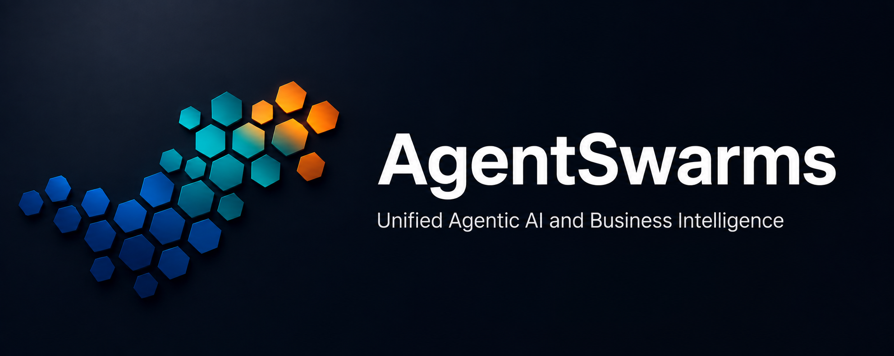
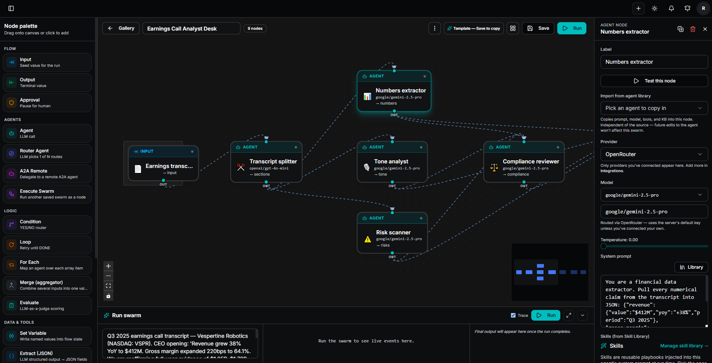
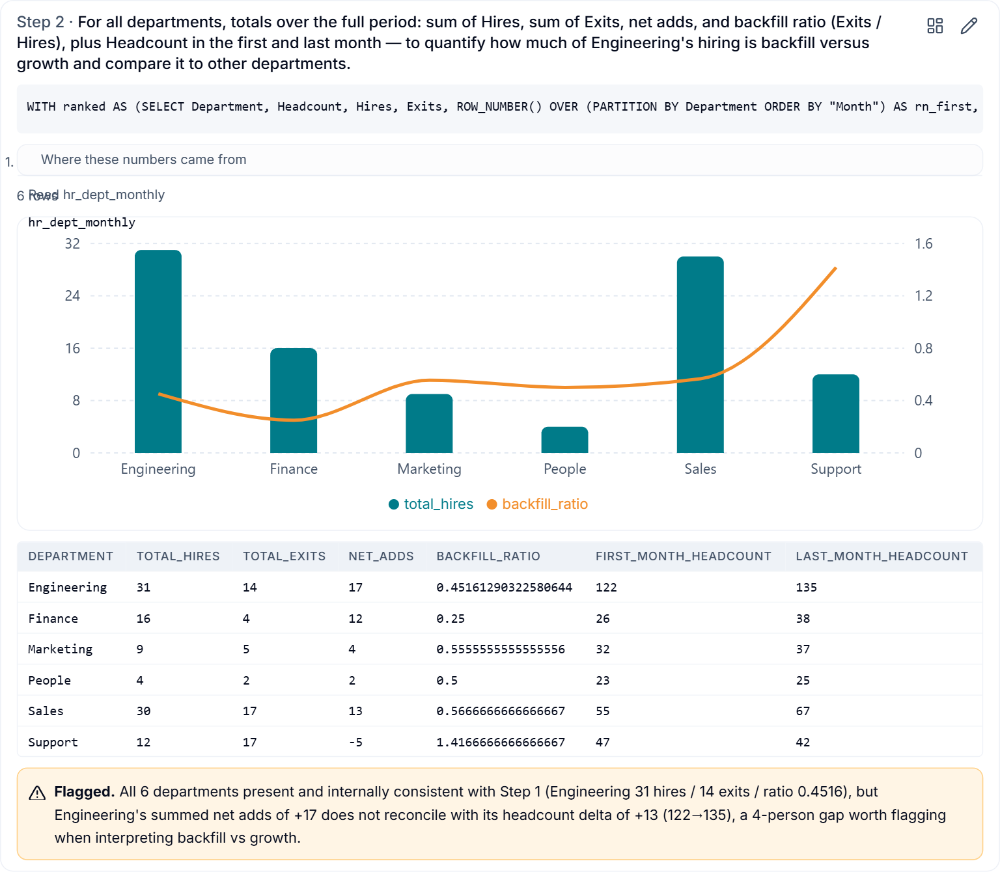
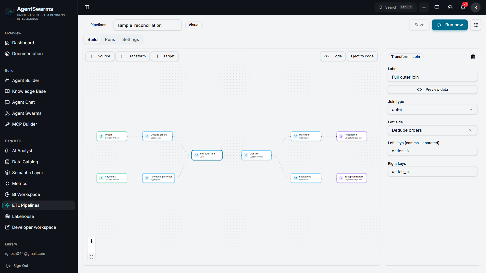
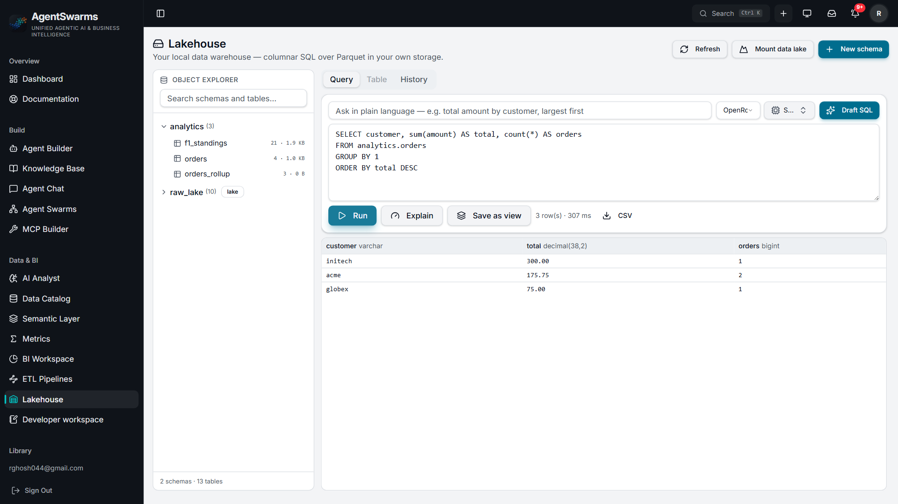
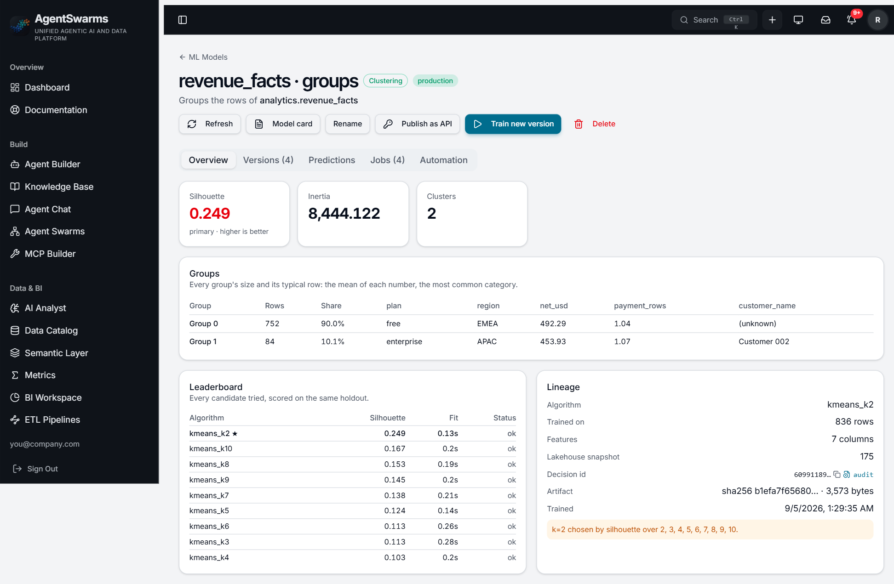
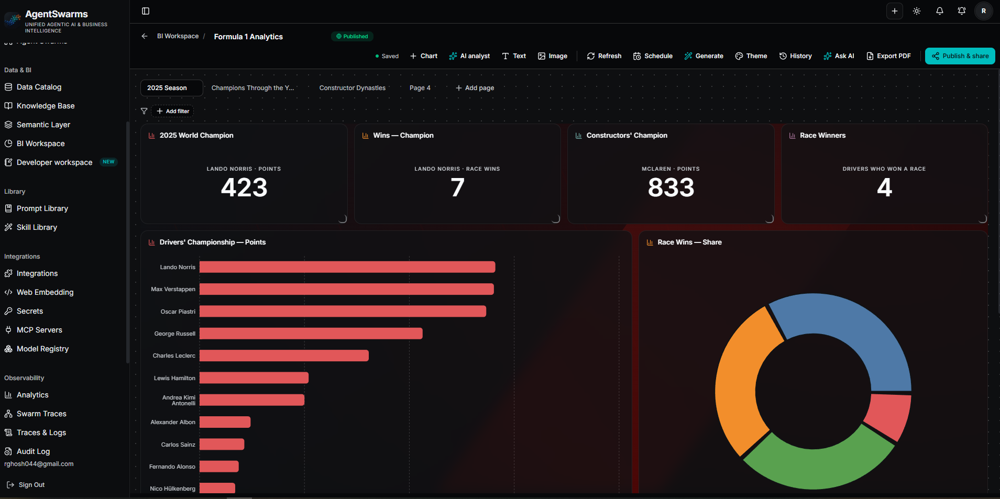
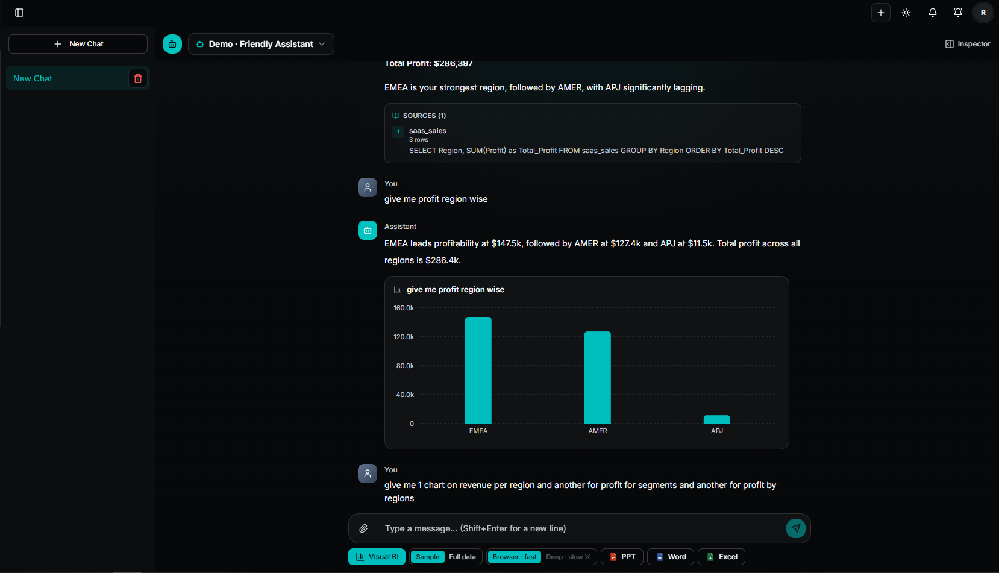
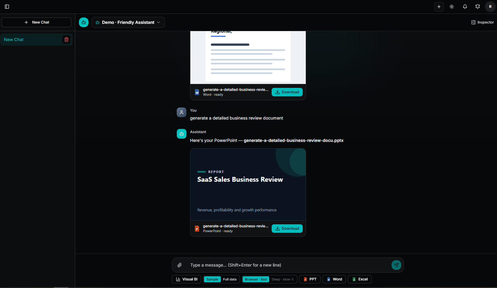
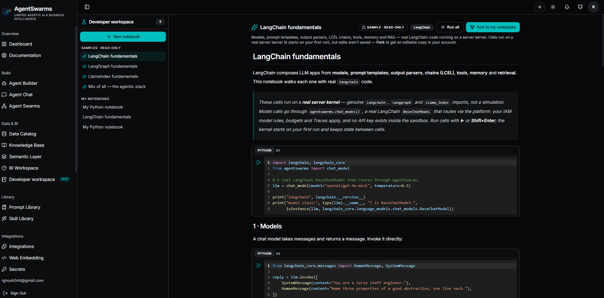

<div align="center">
  

  <p><strong>The self-hosted agentic AI and data platform.</strong><br />
  Build AI agents and multi-agent swarms, land your data in a lakehouse you own,
  and put dashboards, an AI analyst and no-code machine learning on top —
  on your infrastructure, with your model keys, under one set of rules.</p>

  <p>
    
    
    
    
    
    
  </p>

  <p>
    <a href="#a-look-at-it">Screenshots</a> ·
    <a href="#features">Features</a> ·
    <a href="#quickstart">Quickstart</a> ·
    <a href="#documentation">Documentation</a> ·
    <a href="#self-hosted-vs-hosted">Self-hosted vs. hosted</a> ·
    <a href="./CONTRIBUTING.md">Contributing</a>
  </p>
</div>

---

# AgentSwarms: agents that can act, and a data platform worth pointing them at

Most agent platforms stop at the agent and leave the data to you. **AgentSwarms**
ships both halves, source-available and self-hosted: agent chat, a canvas for
multi-agent swarms, RAG knowledge bases and MCP on one side; ETL pipelines, a
DuckDB-and-Parquet lakehouse you own, BI dashboards, an AI analyst that shows
its SQL, and no-code machine learning on the other. One semantic layer, one
catalog with lineage, one IAM and one hash-chained audit trail govern all of it,
so an agent asked about revenue uses the definition your finance team does, a
row filter on a table binds the dashboard and the agent alike, and every answer
traces back to the snapshot it came from. It runs from one Supabase project and
one Docker command, on your model keys.

## Why teams pick it

- **One platform instead of five subscriptions** — agents, RAG, ETL, a lakehouse,
  BI and ML share one login, one permission model and one audit log.
- **Data you keep** — tables are zstd Parquet in your own bucket with a
  transactional catalog; snapshots give time travel; nothing is locked in.
- **Governance that runs before the call** — model rules, spend budgets, row
  filters and column masks are enforced server-side, not reported afterwards.
- **Answers you can check** — the analyst cites its SQL, a forecast says what a
  period is, a trained model says when its score could mislead.
- **Any model, any warehouse** — OpenRouter, OpenAI, Anthropic, Gemini, Bedrock,
  Azure, OCI, Qwen, Grok, Groq, Ollama and vLLM for models; Snowflake, BigQuery,
  Databricks, Redshift, Trino, ClickHouse, Oracle, SQL Server, Postgres and MySQL
  connect directly, alongside file uploads and SaaS sources like Stripe, Shopify
  and HubSpot.
- **Runs where you run** — Docker on a laptop or a VM, or Kubernetes with
  autoscaling; Supabase hosted or self-hosted, so nothing has to leave your network.

## A look at it

**Swarm canvas** — design a multi-agent workflow as a graph and run it end to
end. Each node is a step (agent, router, condition, loop, approval, tool call);
the inspector sets its provider, model, prompt, tools and knowledge. The same
graph runs from the canvas, from the API and on a schedule — the canvas edits a
draft, and API keys and schedules keep serving the last **published** snapshot
until you promote it.



**AI Analyst** — a dedicated conversational-analysis surface: create
analysts (a reasoning model pinned to your data, nothing else to configure)
that plan each question into steps, write and run the SQL, check their own
work, and write up findings where every number cites its step. Every step
gets its own chart, can be pinned to a dashboard or edited and re-run, and
the whole trace exports as a branded PDF. Contribution analysis, trends,
outliers and projections are computed in code rather than narrated — and it
asks a clarifying question instead of guessing when one is genuinely needed.



**ETL pipelines** — move data between systems on a canvas or write ETL code in Python: sources
into joins, aggregates, quality gates and targets, with the compiled Python one
toggle away and AI generate/refine on your own model. Runs execute on a
sandboxed kernel — credentials reach process memory only, never the code or the
container environment — on a schedule or a webhook, with retries, overlap guards
and incremental watermarks. Every successful load re-crawls its destination, so
new tables show up in the catalog for BI, the analyst and agents.



**Lakehouse** — a columnar warehouse of your own, under **Data & BI**. Browse
schemas, tables, columns and snapshots; query them with governed SQL or plain
language; and see what a query actually scanned. Tables are zstd Parquet in your
own bucket with a Postgres catalog, so compute stays stateless and nothing is
locked in.



**ML Models** — no-code machine learning on your lakehouse tables, under
**Data & BI → ML Models**. Pick a table and a goal — predict a column, forecast
a series, find groups, find anomalies, recommend items — and a sandboxed
trainer profiles the data, prepares it (filters, imputation, encoding, text as
features), tries several algorithms under a time budget with optional
hyperparameter search, and keeps the best with its metrics, leaderboard,
permutation importance and a passport (lakehouse snapshot, decision id,
artifact digest). Every model is a registry entry with versions and stages,
scores rows back into the lakehouse — by hand, on a schedule, or through a
scoped public API — is an agent tool, reports drift against its training data,
compares versions side by side, and writes its own model card. Governed like
everything else: IAM shares, trigger audit, decision ids.



**BI Workspace** — multi-page dashboards over your connected tables and
warehouses, with KPIs, cross-filtering, scheduled refresh, PDF export and
publish-and-share links.



**Agent Chat, with Visual BI** — ask a question in plain language and get a
chart computed from your own data beside the answer. The SQL that produced it is
shown as the source, so the number is checkable rather than asserted.



**Agent Chat, generating documents** — turn the conversation and your data into
a real, editable PowerPoint, Word document or Excel workbook. The Excel can pull
every row with live formulas rather than a pasted snapshot.



**Developer workspace** — Python notebooks on sandboxed server kernels with real
`langchain`, `langgraph` and `llama_index` installed. Model and knowledge-base
calls are brokered by the platform, so no provider key ever exists inside the
sandbox. Notebooks can call your deployed agents, and can themselves be
published as callable APIs.



## Features

|                                  |                                                                                                                                                                                                                                                                                                                                                                                                                       |
| -------------------------------- | --------------------------------------------------------------------------------------------------------------------------------------------------------------------------------------------------------------------------------------------------------------------------------------------------------------------------------------------------------------------------------------------------------------------- |
| 🤖 **Agent Chat**                | Build an agent, wire up tools, chat with full request and response traces. **Visual BI** draws a chart from your data beside the answer; a prompt turns into an editable **PowerPoint, Word or Excel**, the Excel with live formulas over every row. [Agent Chat & documents](./docs/AGENT_CHAT.md)                                                                                                                   |
| 🐝 **Swarm canvas**              | Multi-agent workflows as a graph, run from the canvas, the API or a schedule. Deployed runs checkpoint as they go and survive a restart; a human-approval step parks the run until someone decides.                                                                                                                                                                                                                   |
| 📚 **Knowledge Base / RAG**      | Uploads, crawled sites, repos, and **Google Drive, Notion, SharePoint, Dropbox and Confluence** synced on a schedule with two-level dedup. Hybrid search, parent-child and Q&A indexing on pgvector, citations, and per-source access scopes down to the provider's own sharing. [Knowledge bases](./docs/KNOWLEDGE_BASES.md)                                                                                         |
| 🏢 **Data Sources**              | **29 connectors**: 22 databases and warehouses (PostgreSQL, MySQL, SQL Server, Oracle, Snowflake, Databricks, BigQuery, Redshift, Synapse, Trino, Athena, ClickHouse, CockroachDB, TimescaleDB and more) queried in place, read-only, with encrypted credentials; 7 apps (Google Sheets, Stripe, Shopify, HubSpot, Salesforce, Jira, Zendesk); and the built-in lakehouse. [Connectors](./docs/DATA_SOURCES.md)       |
| 🗂️ **Data Catalog**              | Crawls warehouses, S3-compatible buckets and Iceberg REST catalogs: schema inference, column profiles, likely-PII flags, row estimates, lineage and usage, a business glossary, AI-written documentation, certification and deprecation, scheduled re-crawls with drift alerts.                                                                                                                                       |
| 📊 **Business Intelligence**     | Drag-and-drop multi-page dashboards with 19 visual types, cross-filter and drill-through, incremental refresh, SQL aggregation pushdown, data alerts, row and column security on shares, workspaces and folders, dev-to-prod promotion and Git export. Plus the **AI Analyst**: plan, query, self-check, write up, every number cited. [Business intelligence](./docs/BUSINESS_INTELLIGENCE.md)                       |
| 🧭 **Semantic Layer**            | Metrics and dimensions defined once and used by dashboards and agents alike, with joins declared across a star schema so the AI picks a metric name instead of writing SQL. [Semantic layer](./docs/SEMANTIC_LAYER.md)                                                                                                                                                                                                |
| 🔁 **ETL Pipelines**             | A visual canvas with the compiled Python one toggle away, a full code mode, and AI generate/refine on your own model. Object storage, databases, HTTP APIs, webhooks, **change-data-capture** and the lakehouse in; storage, databases, Snowflake, BigQuery, Databricks and the lakehouse out. Cron with real timezones, retries, overlap guards, watermarks, quality gates. [ETL pipelines](./docs/ETL_PIPELINES.md) |
| 🏛️ **Lakehouse**                 | A columnar warehouse built in: DuckDB over zstd Parquet in your bucket with a Postgres transactional catalog. Snapshot time travel, partition pruning, a snapshot-keyed result cache, materialized views, spill to disk, compaction, mounted data lakes, and row filters and column masks rewritten into the query's parse tree. [Lakehouse](./docs/LAKEHOUSE.md)                                                     |
| 🧪 **ML Models**                 | No-code classification, regression, forecasting, clustering, anomaly detection and recommendations on lakehouse tables: a sandboxed trainer, a registry with versions and stages, batch predictions back into the lakehouse, drift alerts, scheduled retraining, model cards, an agent tool and a scoped public API. [Machine learning](./docs/ML.md)                                                                 |
| 🔍 **Observability**             | Every tool call, token and cost in an execution trace; an audit trail of who did what with configurable retention; spend analytics by user and group.                                                                                                                                                                                                                                                                 |
| 🌐 **Web search & browsing**     | `web_search` and `web_browse` work with no key through a built-in fetcher and DuckDuckGo; add Firecrawl, Brave, SerpAPI, Tavily or ScrapingBee for ranked results and JavaScript pages. Every fetch is SSRF-guarded. [Setup](./docs/INSTALL.md#web-search--browsing-optional)                                                                                                                                         |
| 🔌 **BYOK, MCP and A2A**         | Encrypted per-user provider keys, MCP servers in and out, swarm export to LangGraph, CrewAI, the OpenAI SDK and Strands, and an A2A endpoint.                                                                                                                                                                                                                                                                         |
| 🛠️ **MCP Builder**               | Write an MCP server in Python with FastMCP, deploy it to the sandboxed runtime as a Streamable-HTTP endpoint, expose it with hashed keys and per-tool limits; a redeploy that changes a tool blocks calls until re-approved.                                                                                                                                                                                          |
| 🌍 **Web embedding + React SDK** | Put agents, swarms, dashboards and the analyst on any site with an iframe snippet or `@agentswarms/react` hooks; domain allow-lists, budgets and rate limits are enforced server-side. [React SDK](./sdk/react/README.md)                                                                                                                                                                                             |
| 🛂 **IAM**                       | Superadmins, groups, invitations, per-user and per-group model allow-lists, read-only sharing, row filters and hidden columns on shared dashboards, invite-only mode, SAML SSO. [Access control](./docs/IAM.md)                                                                                                                                                                                                       |
| 📓 **Developer workspace**       | Python notebooks on sandboxed server kernels with real LangChain, LangGraph and LlamaIndex, runnable samples, a helper that calls your models, knowledge bases and agents with no key inside the sandbox, and notebooks published as APIs. [Runtime guide](./docs/DEVELOPER_WORKSPACE_RUNTIME.md)                                                                                                                     |
| 🔑 **Secrets Manager**           | Store a credential once, encrypted and write-only, and reference it anywhere as `{{secret:NAME}}`; share with users and groups through IAM.                                                                                                                                                                                                                                                                           |
| 🛡️ **Guardrails & evals**        | Prompt-injection tests, PII redaction and LLM-as-judge scoring against your own agents.                                                                                                                                                                                                                                                                                                                               |

## Where it stands

A checkable scorecard: every line links to the document that backs it, and
the counts are pinned by tests so they cannot drift.

**Strong, and verified here**

- **Everything runs on your infrastructure** — app, notebooks, sandboxes,
  lakehouse catalog and Parquet in Docker or Kubernetes; the only outbound
  calls are the ones you configure ([DEPLOYMENT.md](./docs/DEPLOYMENT.md)).
- **Coverage** — 29 connectors ([DATA_SOURCES.md](./docs/DATA_SOURCES.md)),
  six knowledge-base sources ([KNOWLEDGE_BASES.md](./docs/KNOWLEDGE_BASES.md)),
  local embeddings via Ollama or vLLM.
- **Decision provenance** — every answer carries a decision id and lakehouse
  snapshot, exports as a signed Answer Passport, and replays as of the moment
  it was given ([PROVENANCE.md](./docs/PROVENANCE.md)).
- **Governance that holds in the database** — row filters and column masks as
  security-definer functions, deny-by-default model access, SAML SSO, and a
  hash-chained audit log that survives user deletion ([IAM.md](./docs/IAM.md)).
- **Machine learning without leaving the platform** — six task types trained
  in sandboxes on lakehouse tables, a registry with stages, predictions written
  back, drift alerts, and a trainer that says when a score could mislead
  ([ML.md](./docs/ML.md)).
- **Operations** — `npm run backup` captures the four stateful things and
  `npm run restore -- <dir> --drill` proves the backup restores
  ([backups and restore](./docs/DEPLOYMENT.md#backups-and-restore)).

**Not there yet — stated so nobody has to discover it**

- **No SCIM** — users arrive through SSO or invitation; groups are managed in
  IAM, not pushed from the IdP.
- **One vector store** — pgvector inside the application database; Qdrant,
  Weaviate and Pinecone are not supported.
- **High availability of the lakehouse catalog is yours to provide** — the
  compose file runs one Postgres container; point `LAKEHOUSE_CATALOG_URL` at a
  managed or replicated Postgres for anything you cannot lose between backups.
- **Credentialed connectors are verified to validation, not in CI against live
  tenants** — Confluence, Azure Blob, Jira and Zendesk check the credential when
  connected; their signing, pagination and parsing are unit-tested on fixtures.

## Self-hosted vs. hosted

Same UI, two missions. The "AgentSwarms" name and the hosted service remain
with the project author.

|              | **This repository** (source-available, Elastic License 2.0)                                                           | **[agentswarms.fyi](https://agentswarms.fyi)** (hosted)                                                                       |
| ------------ | --------------------------------------------------------------------------------------------------------------------- | ----------------------------------------------------------------------------------------------------------------------------- |
| **Focus**    | Deploy the full agentic AI and data platform on your own infrastructure: agents, swarms, RAG, ETL, lakehouse, BI, ML. | Learning first: a guided curriculum, build-along labs, interactive notebooks, presentations and certification, fully managed. |
| **Runs on**  | Your Supabase project, your provider keys, your Docker host or cluster.                                               | Managed infrastructure with an AI gateway and free-tier models; nothing to configure.                                         |
| **Best for** | Teams and tinkerers who want to **run** a platform they own, with no caps beyond their own budgets.                   | Learners who want to **study and practice** agentic AI without setting anything up.                                           |

## Quickstart

**One-command setup** — after you've created a Supabase project and put its keys
in `.env` (see below), a script handles the rest (secrets, deps, migrations, and
bringing up the stack):

```bash
cp .env.example .env      # fill in your Supabase keys, then:
bash scripts/setup.sh --all           # EVERYTHING  →  http://localhost:8080
# bash scripts/setup.sh               # core stack only (the app; optional services off)
# bash scripts/setup.sh --dev         # local dev server instead
# Windows PowerShell:  powershell -ExecutionPolicy Bypass -File scripts\setup.ps1 -All
```

**No Supabase account at all?** One command deploys the entire solution —
**self-hosted Supabase (Docker) + the app** — with nothing to sign up for and
nothing to copy by hand. The script downloads and starts the official Supabase
Docker stack, generates every secret and key (Postgres password, JWT secret,
the API keys signed from it), applies the schema, creates your admin user, and
writes all of it into `.env` automatically before bringing up the app:

```bash
bash scripts/setup-selfhosted.sh --all      # Supabase + EVERYTHING  →  http://localhost:8080
# ADMIN_EMAIL=you@corp.com bash scripts/setup-selfhosted.sh --all   # non-interactive
# Windows: run it in WSL or Git Bash, with Docker Desktop running
```

Budget ~2 GB of image pulls and +2 vCPU / +4 GB RAM for the Supabase stack.
Details, production hardening and the manual equivalent:
**[INSTALL.md § self-hosted](./docs/INSTALL.md#option-b--self-hosted-supabase-docker-no-account-needed)**
and **[DEPLOYMENT.md § Self-hosted Supabase](./docs/DEPLOYMENT.md#self-hosted-supabase-complete-data-residency)**.

**On Kubernetes, fully self-hosted** — the same thing on a cluster, with
Supabase itself running as pods. One command brings up everything: Postgres,
authentication, the REST and Realtime APIs, file storage, the app, the Office
renderer, the JS sandbox and the lakehouse catalog. Nothing is optional and
nothing leaves the cluster:

```bash
ADMIN_EMAIL=you@corp.com ADMIN_PASSWORD='...' bash scripts/setup-k8s.sh
kubectl -n agentswarms port-forward svc/agentswarms 8080:80   # then http://localhost:8080
```

It generates every secret (including the API keys **signed** from the JWT
secret), applies the schema, creates your admin user, and waits for each piece
in the order that actually works. See
**[DEPLOYMENT.md § Kubernetes](./docs/DEPLOYMENT.md#d-kubernetes)**.

Or do it by hand — there is no separate backend to install, since **Supabase
_is_ the backend** (Postgres + Auth + Storage), run as a free-tier hosted
project rather than installing anything yourself:

```bash
git clone https://github.com/AgentSwarms-fyi/agentswarms.git
cd agentswarms
npm install
cp .env.example .env   # fill in your Supabase + provider keys
# apply the database schema once: npx supabase login && npx supabase link && npx supabase db push
npm run dev            # → http://localhost:8080
```

Self-host with Docker (any Node-capable host — VPS, Fly, Railway, Render, K8s):

```bash
cp .env.example .env   # fill in Supabase + keys, apply migrations once
docker compose --profile all up --build
# → http://localhost:8080   (plain `docker compose up --build` starts the app alone)
```

`--profile all` (or the setup script's `--all`) brings up the optional services too: the
**document renderer** (native PowerPoint/Word/Excel), the **JS sandbox** (custom
code in deployed swarm runs) and the **Developer-workspace runtime** (real Python
kernels). They are separate profiles because each costs something — LibreOffice
is a large image, and the notebook runtime needs Docker-socket access through a
least-privilege proxy. Once up, **Observability → Monitoring** shows every
service's health in one place.

First time? Follow **[the full installation guide](./docs/INSTALL.md)** — it
covers every step on macOS, Linux, and Windows, including the Supabase
dashboard clicks and a troubleshooting section for the errors people
actually hit. Wondering what hardware you need (spoiler: a 2 vCPU / 4 GB VM,
no GPU — ML training included, on CPU; 16 GB if you train)? See
**[System requirements & sizing](./docs/SYSTEM_REQUIREMENTS.md)**.

**"Does it handle billions of rows?"** Aggregate queries compile to SQL that
runs **inside your warehouse** — or inside the lakehouse, where columnar scans
and partition pruning keep large tables workable on one node, and a query that
outgrows RAM spills to disk instead of failing. Either way only the grouped
result travels. Anything that materialises locally is capped — local datasets at
500k rows, dashboard snapshots at 500 rows, warehouse result sets at 1,000
(5,000 hard ceiling). Every number, and the environment variable that changes
it, is in **[Scale and limits](./docs/SCALE_AND_LIMITS.md)**. The honest
ceilings of single-node compute are spelled out in
**[the lakehouse guide](./docs/LAKEHOUSE.md)**.

## Documentation

One focused guide per topic in [`docs/`](./docs):

- **Get running** — [Installation](./docs/INSTALL.md) ·
  [System requirements & sizing](./docs/SYSTEM_REQUIREMENTS.md) ·
  [Production deployment](./docs/DEPLOYMENT.md) (VMs, Kubernetes, TLS,
  [backups & restore](./docs/DEPLOYMENT.md#backups-and-restore)) ·
  [Scale and limits](./docs/SCALE_AND_LIMITS.md) ·
  [Schema health check](./docs/SCHEMA_HEALTH_CHECK.md) ·
  [Testing](./docs/TESTING.md)
- **Data** — [Data sources & connectors](./docs/DATA_SOURCES.md) ·
  [ETL pipelines](./docs/ETL_PIPELINES.md) · [Lakehouse](./docs/LAKEHOUSE.md) ·
  [Semantic layer](./docs/SEMANTIC_LAYER.md) ·
  [Business intelligence](./docs/BUSINESS_INTELLIGENCE.md) ·
  [Machine learning](./docs/ML.md) ·
  [End to end: data and AI](./docs/END_TO_END_DATA_AND_AI.md), a worked
  scenario with seven planted defects and the pipeline, metric, dashboard and
  policy that catch them
- **Agents** — [Agent Chat & document generation](./docs/AGENT_CHAT.md) ·
  [Knowledge bases](./docs/KNOWLEDGE_BASES.md) ·
  [Developer workspace runtime](./docs/DEVELOPER_WORKSPACE_RUNTIME.md) ·
  [Extending agents with skills and tools](./docs/EXTENDING.md) ·
  [React SDK](./sdk/react/README.md)
- **Governance and operations** — [Access control (IAM) & SSO](./docs/IAM.md) ·
  [Decision provenance](./docs/PROVENANCE.md) ·
  [Key management](./docs/KEY_MANAGEMENT.md) ·
  [Model pricing](./docs/MODEL_PRICING.md) ·
  [Architecture](./docs/ARCHITECTURE.md) ·
  [The engineering behind AgentSwarms](./docs/engineering/README.md), seven
  chapters on how it is built

## Contributing, security and license

Contributions are welcome: see [CONTRIBUTING.md](./CONTRIBUTING.md) and the
[Code of Conduct](./CODE_OF_CONDUCT.md). Found a vulnerability? Report it
privately as described in [SECURITY.md](./SECURITY.md) rather than opening a
public issue.

AgentSwarms is **source-available** under the
[Elastic License 2.0](./LICENSE.md): use it, self-host it, modify it and
redistribute it freely, but do not offer it to third parties as a hosted or
managed service, and keep the notices. A commercial license for uses ELv2 does
not permit, including running it as a SaaS, is available from the author. The
"AgentSwarms" name, logo and hosted service are trademarks of the project
author; ELv2 covers the code, not the brand. Every direct dependency is
permissively licensed (MIT / Apache-2.0 / ISC / BSD); the credits for the
open-source projects AgentSwarms builds on are in
[ACKNOWLEDGEMENTS.md](./ACKNOWLEDGEMENTS.md).

---

<div align="center">
  <sub>Built with TanStack Start and Supabase — an agentic AI &amp; data platform you own.</sub>
</div>
